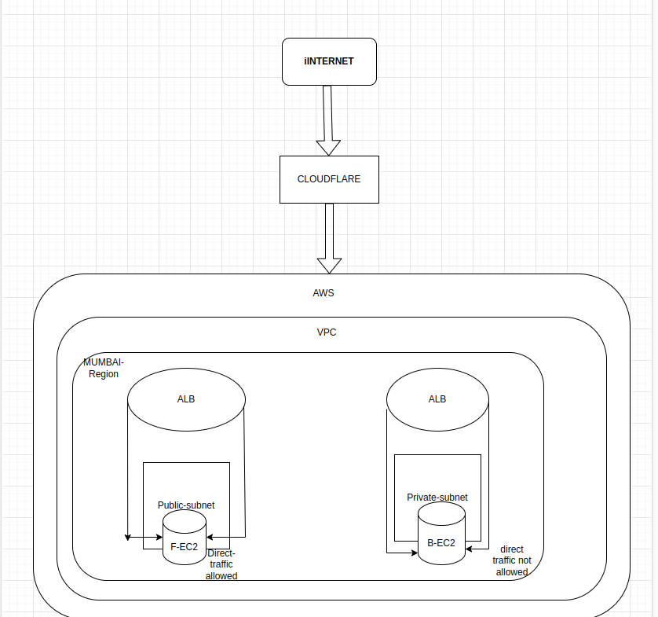
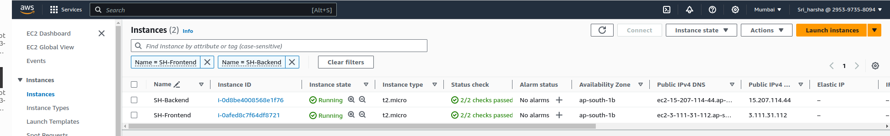
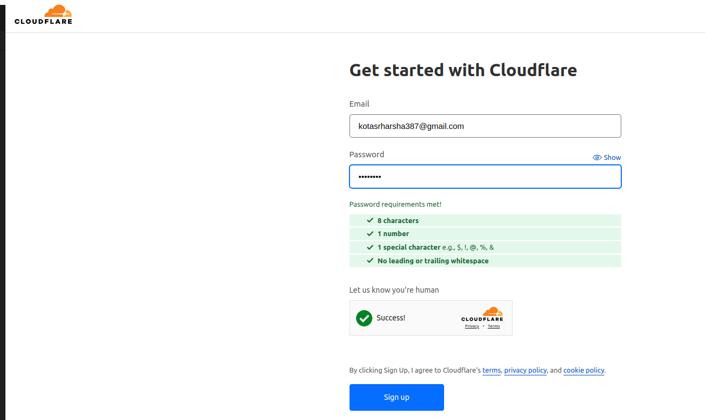
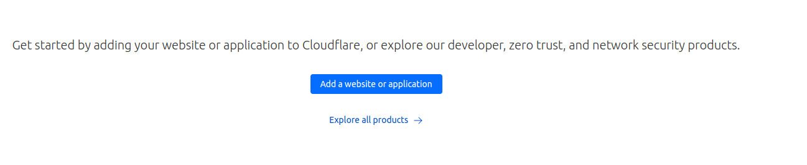
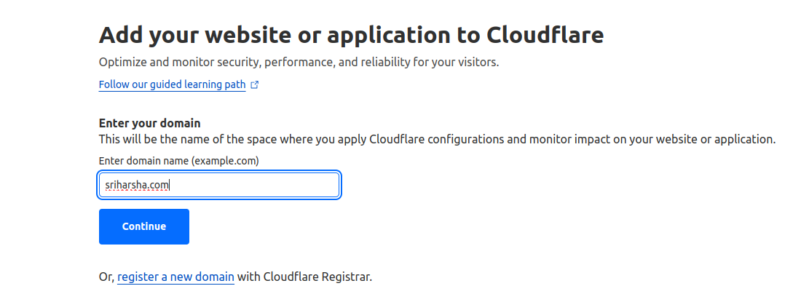

# Travel Memory application


# Architecture of Travel memory application



1. Infrastructure setup

* created two frontend and two instances for backend application.



* After launching the instances you need to make sure that instances should be opened for port 80 and 443 in the inbound rules.

2.Now open the backend instance and install the necessary dependancies for running the application in ec2

* We need to update the packages

```bash
sudo apt update
```

* For running the applications we need to install node v18.0.1 for we need to install curl and install the nodejs

```bash
 curl -fsSL https://deb.nodesource.com/setup_18.x | sudo -E bash -
```

```bash
sudo apt install nodejs
```
* we need to check whether the node version has installed properly or not..

```bash
node -v
```
```txt
v18.17.1
```
* Now we need to create a .env file in the backend for using a database

```txt
mongourl='***'
port=3000
```
* Now we need to save the file and run the command to install the dependencies for our backend application

```bash
sudo npm install
```
* Now we can start the backend application through by using the command

```bash
sudo npm run start
```
* Now we need NGINX to do the reverse proxy where the requests coming to port number 80 and 443 for the outside.

* First we need to update the packages

```bash
sudo apt-get update
```

* we need to install  nginx

```bash
sudo apt install nginx
```

* we need to start the nginx using the command

```bash
sudo systemctl start nginx
```

* check the status of the nginx

```bash
sudo systemctl status nginx
```

* Now navigate to the nginx folder 

```txt
cd /etc/nginx/sites-enabled
```

```bash
sudo nano default
```

```txt
server {
        listen 80;
        listen [::]:80;
location / {
    proxy_pass http://localhost:3000;
    include proxy-parms;
}
}
```

* Now save the file and reload the nginx server

```bash
sudo systemctl reload nginx
```

* we can start the application using command

```bash
sudo node .\index.js
```
## Now we need to configure the frontend application and necessary dependancies

* First we need to update the packages

```bash
sudo apt update
```

* we need to clone the REPO from the git

```bash
git clone https://github.com/UnpredictablePrashant/TravelMemory.git
```
* we need to install nodejs 18.0.1 version using curl 

```bash

```

* Now we need to install node js
using the command 

```bash
sudo apt install nodejs
```

* To check the node version use the command

```bash
node -v
```

```txt
v18.17.1
```
* Now we need to install nginx on our frontend EC2 machines

```bash
sudo apt install nginx
```
* TO start the nginx

```bash
sudo systemctl start nginx
```

* To check the status of the nginx

```bash
sudo systemctl status nginx
```

* Our nginx is configured on our frontend ec2 instances sucessfully

* To install the dependancies of application in frontend insdide frontend directory install npm

```bash
sudo npm install
```

* To start the frontend application
use the command

```bash
sudo npm run start 
```

* Our application has started sucessfully

## Now we need to setup the domain for our Travel memory application

* First we need to create a cloudfare account and we need to setup the domains for our frontend and backend running instances

```txt
http://dash.cloudflare.com
```


* After we need to click on add the website by 



* Then we need to register the domain based up on your requirements



* It will take sometime but once the domain is ready it will came into active status.

* Now we need to click on add record and need to create a subdomains for the frontend and backend applications

Here

## sriharsha.com ---This is the primary domain 

## sriharsha.backend.com -- Backend domain

## sriharsha.frontend.com -- Frontend domain

* Add these records and save it so that we can able to access the domains

* we need to change the url.js in the EC2 frontend instances  and need to update the URL and re-start the Frontend-application 

```txt
export const baseurl=https://backend.sriharsha.com
```

## Now we need to setup the load balancer for our application 

* Here we are going to setup 2 load balancers one is for the frontend and the another one is for backend.

* Login into aws account and create the load balancers.

* There are 3 types of load balancers are there here we are using Application load balancer.

* click on create and configure the appropriate name for the load balancers

* we need to give the name and choose the internet-facing option in the scheme.

* Then we need to configure the network and select the virtual private cloud (VPC) where we created the ec2 instances.

* select the vpc and check the availability zones and we need to configure a lister in using the port that we configure and a rule for the listerner through the ALB routes the request to it targets.

* This process we need to do for both frontend and backend then we need to specify in the cloudflare portal and we have to choose our application website and have to specify the CNAME record for both frontend and backend .

* Finally we need to edit our frontend ec2 instance and change the URL.JS for the internal elb ip address from the load balancer then we need to resstart our frontend application after that setting the internal elb for the backend the traffic will flows through the internal loabalancer to the specifc target group that we specified .

* setup has done sucessfully.